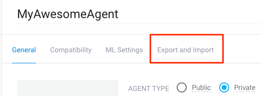

# Viber chat bot sample using API.AI and Node.js

This is a simple chat bot, built using API.AI and Node.js, to generate a nutrition fact based on your input. The bot utilize data.gov API for [nutrition facts](https://ndb.nal.usda.gov/ndb/).

## Setup Instructions

### Pre-requisites
 1. [API.AI account](https://api.ai)
 2. [Viber Public Account](https://www.viber.com/en/public-accounts)
 3. [Data.gov API key](https://api.data.gov/signup/)

See the developer guide at [developers.viber.com](https://developers.viber.com/public-accounts/index.html#access) for more details.

# Deploy to:

### Steps
 1. Create a new agent in [api.ai](https://api.ai).
 1. Click on the project gear icon to see the project settings.
 1. Select "Export and Import". 
 1. Select "Restore from zip". Follow the directions to restore.
 1. Select the `ViberSampleAgent.zip` file in this repository.
 1. [Optional] Set your [Data.gov API key](https://api.data.gov/signup/) in the environment variable:
	 1. Copy the sample environment variable `cp .env.sample .env`. 
	 1. Edit `.env` with your Data.gov API key.
 1. Deploy this app to your preferred hosting environment.
 1. Set the "Fulfillment" webhook URL to `https://[App Name].herokuapp.com/hook`.
 1. Enable Viber in the API.AI integrations panel.
 1. For both `meal.info` and  `nutrition.info` intents check the ‘Use webhook’ in the ‘Fulfillment’ section, and save the intent.

## References and How to report bugs
If you find any issues with this sample, please open a bug here on GitHub.

## License
See [License](LICENSE.md).

## Terms
Your use of this sample is subject to, and by using or downloading the sample files you agree to comply with, the [Viber API Terms of Service](https://developers.viber.com/general/api-terms-of-service/index.html/).

## Community
Viber/API.AI developers community on [Gitter](https://gitter.im/viber/apiai-integration).